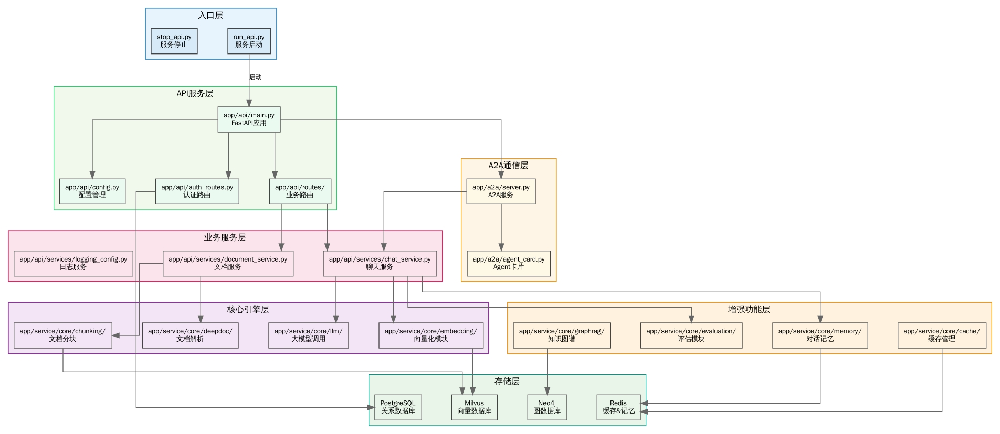
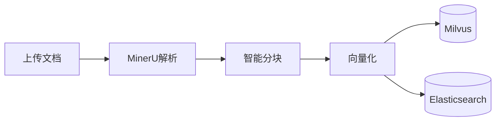
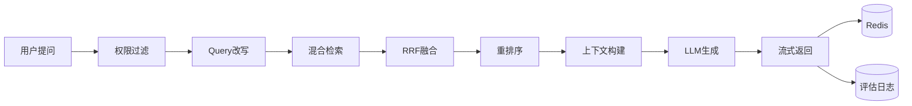
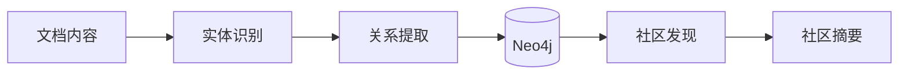
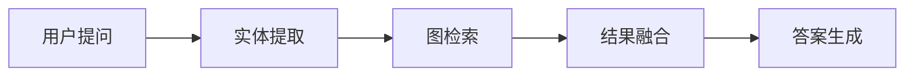
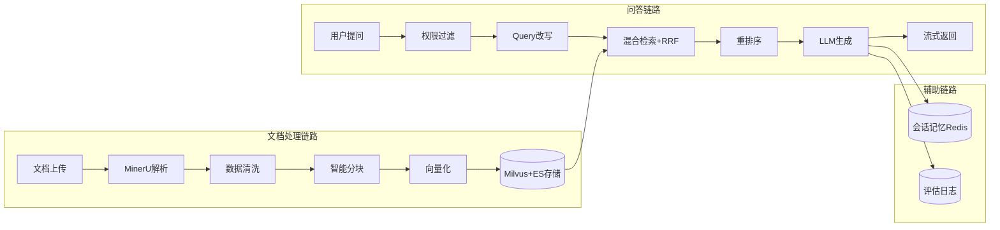
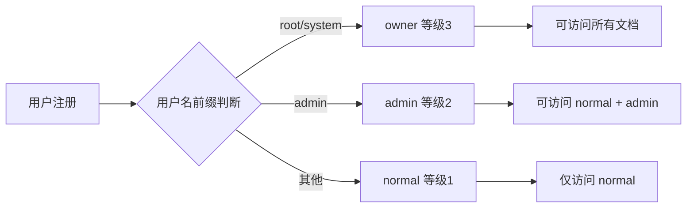

# PaperReadingRAG

**专业的企业级 行业研究分析助手RAG | 混合检索 | GraphRAG | 多级权限 | A2A 协议**

---

## 📖 简介

PaperReadingRAG 是一个生产级的 RAG（Retrieval-Augmented Generation）文档问答系统，采用模块化架构设计，提供从文档上传、智能解析、向量化存储到精准问答的完整解决方案。系统支持多格式文档处理、混合检索、知识图谱增强、多轮对话记忆，并集成了完善的用户认证与权限管理体系。

### 核心特性

- 📄 **智能文档处理** - 支持 PDF/DOCX/TXT/MD/Excel 等多种格式，集成 MinerU 高质量解析
- 🔍 **Advanced RAG** - 混合检索（向量 + BM25）+ RRF 融合 + Query 改写 + 重排序
- 🕸️ **GraphRAG** - 知识图谱增强检索，实体关系推理，社区摘要
- 💭 **会话记忆** - Redis 持久化存储，支持多轮对话上下文
- 🔐 **多级权限** - normal / admin / owner 三级用户权限体系
- 🤝 **A2A 协议** - Agent-to-Agent 通信，易于集成到多 Agent 系统
- 📊 **RAG 评估** - Faithfulness、Answer Relevancy、Context Recall 等指标
- ⚡ **异步处理** - 队列化文档处理，支持批量上传/删除

---

## 🏗️ 系统架构

### 整体架构图



### 文档处理流程



### 问答检索流程



### GraphRAG 流程

**第一阶段：图谱构建**



**第二阶段：问答检索**



### 数据流向



### 权限控制体系



## 📁 项目结构

```
PaperReadingRAG/
├── run_api.py                  # API 服务入口
├── stop_api.py                 # 停止服务脚本
├── app/
│   ├── api/                    # API 路由层
│   │   ├── routes/             # 路由模块
│   │   │   ├── chat.py         # 智能问答（同步/流式）
│   │   │   ├── upload.py       # 文档上传
│   │   │   ├── delete.py       # 文档删除
│   │   │   ├── delete_batch.py # 批量删除
│   │   │   ├── graph_rag.py    # GraphRAG 接口
│   │   │   └── health.py       # 健康检查
│   │   ├── services/           # 业务服务
│   │   │   ├── chat_service.py # 问答服务（含评估）
│   │   │   └── document_service.py
│   │   ├── auth_routes.py      # JWT 认证
│   │   └── main.py             # FastAPI 应用
│   ├── service/                # 核心服务层
│   │   └── core/
│   │       ├── rag/            # RAG 核心
│   │       │   ├── processor.py    # 文档处理流程
│   │       │   ├── search.py       # 混合检索
│   │       │   ├── generation.py   # LLM 生成
│   │       │   ├── cached_search.py
│   │       │   └── async_processor.py
│   │       ├── retrieval/      # 检索增强
│   │       │   ├── hybrid_retriever.py  # 混合检索器
│   │       │   ├── es_bm25_retriever.py # ES BM25
│   │       │   ├── reranker.py         # 重排序
│   │       │   └── query_rewriter.py   # Query 改写
│   │       ├── graphrag/       # 知识图谱 RAG
│   │       │   ├── graph_rag_service.py
│   │       │   ├── entity_extractor.py
│   │       │   ├── neo4j_store.py
│   │       │   ├── community_detection.py
│   │       │   └── graph_retriever.py
│   │       ├── embedding/      # 向量化
│   │       ├── vector_store/   # Milvus 存储
│   │       ├── memory/         # 会话记忆 (Redis)
│   │       ├── llm/            # LLM 调用
│   │       ├── prompt/         # Prompt 模板
│   │       ├── deepdoc/        # 文档解析 (MinerU)
│   │       ├── chunking/       # 智能分块
│   │       ├── cache/          # 多级缓存
│   │       └── evaluation/     # RAG 评估
│   ├── a2a/                    # A2A 协议实现
│   ├── auth/                   # JWT 工具
│   ├── db/                     # PostgreSQL 模型
│   └── web/                    # Web 前端界面
├── uploads/                    # 上传文件存储
├── logs/                       # 日志目录
└── docparselist/               # MinerU 解析报告
```

---

## 🚀 快速开始

### 环境要求

- Python 3.9+
- MinerU API Token（[申请地址](https://mineru.net)）

### 1. 克隆项目

```bash
git clone https://github.com/yourusername/PaperReadingRAG.git
cd PaperReadingRAG
```

### 2. 安装依赖

```bash
python -m venv venv
source venv/bin/activate
pip install -r requirements.txt
```

启动的服务：

- Milvus (19530) - 向量数据库
- Elasticsearch (9200) - BM25 检索
- Redis (6379) - 会话/缓存
- Neo4j (7687) - 知识图谱
- PostgreSQL (5432) - 用户数据

### 3. 启动服务

```bash
python run_api.py --host 0.0.0.0 --port 8001 --reload
python run_api.py --a2a-only --port 8004
```

### 4. 验证服务

```bash
curl http://localhost:8001/api/health
curl http://localhost:8001/.well-known/agent.json
curl http://localhost:8001/a2a/health
```

访问 Web 界面：http://localhost:8001

---

## 📡 API 接口

### 认证接口

| 方法   | 路径                   | 说明       |
| ---- | -------------------- | -------- |
| POST | `/api/auth/register` | 用户注册     |
| POST | `/api/auth/login`    | 用户登录     |
| POST | `/api/auth/verify`   | 验证 Token |

### 文档管理

| 方法     | 路径                                | 说明       |
| ------ | --------------------------------- | -------- |
| POST   | `/api/upload`                     | 上传文档（同步） |
| POST   | `/api/upload/async`               | 上传文档（异步） |
| POST   | `/api/upload/batch`               | 批量上传     |
| GET    | `/api/upload/list`                | 文档列表（分页） |
| DELETE | `/api/upload/{filename}`          | 删除文档     |
| POST   | `/api/upload/delete-batch`        | 批量删除     |
| GET    | `/api/upload/status/{process_id}` | 处理状态     |

### 智能问答

| 方法     | 路径                               | 说明          |
| ------ | -------------------------------- | ----------- |
| POST   | `/api/chat/ask`                  | 同步问答        |
| POST   | `/api/chat/ask/stream`           | 流式问答        |
| POST   | `/api/chat/search`               | 仅检索（不生成）    |
| POST   | `/api/chat/generate`             | 仅生成（基于检索结果） |
| GET    | `/api/chat/session/create`       | 创建会话        |
| GET    | `/api/chat/session/{id}/history` | 会话历史        |
| DELETE | `/api/chat/session/{id}`         | 清除会话        |

### GraphRAG 接口

| 方法   | 路径                                 | 说明            |
| ---- | ---------------------------------- | ------------- |
| POST | `/api/chat/graph/ask`              | GraphRAG 问答   |
| POST | `/api/chat/graph/ask/stream`       | GraphRAG 流式问答 |
| POST | `/api/chat/graph/build`            | 构建知识图谱        |
| GET  | `/api/chat/graph/status`           | 图谱状态          |
| POST | `/api/chat/graph/invalidate-cache` | 清除图谱缓存        |

### A2A 协议接口

| 方法   | 路径                        | 说明           |
| ---- | ------------------------- | ------------ |
| GET  | `/.well-known/agent.json` | Agent 发现（标准） |
| GET  | `/a2a/health`             | 健康检查         |
| POST | `/a2a/rag/search`         | RAG 检索       |
| POST | `/a2a/rag/ask`            | RAG 问答       |
| GET  | `/a2a/capabilities`       | 能力摘要         |

---

## 🔧 核心模块详解

### Advanced RAG 流程

```python
# 完整问答流程
question = "什么是RAG技术？"
session_id = "user-123"

1. Query 改写 (同义词扩展)
2. 混合检索 (向量 + BM25, RRF 融合)
3. 重排序 (Cross-Encoder)
4. 上下文构建 (带文档来源)
5. LLM 生成 (流式输出)
6. 会话记忆保存 (Redis)
7. 异步评估 (Faithfulness/Relevancy)
```

### GraphRAG 流程

```python
# 知识图谱增强流程
1. 实体识别 (规则 + LLM)
2. 关系提取
3. Neo4j 存储
4. 社区发现 (Louvain 算法)
5. 社区摘要生成
6. 图检索 (实体为中心 + RRF 融合)
7. 推理路径展示
```

### 权限控制

```python
# 用户等级与文档访问控制
等级体系: normal (1) → admin (2) → owner (3)

权限规则:
- normal: 只能访问/删除 normal 文档
- admin: 可访问/删除 normal 和 admin 文档
- owner: 可访问/删除所有文档

# 自动等级分配
username 以 'root'/'system' 开头 → owner
username 以 'admin' 开头 → admin
其他 → normal
```

---

## 📊 RAG 评估指标

系统自动记录以下评估指标到 `logs/evaluation_*.log`：

| 指标                | 说明            | 评估方式   |
| ----------------- | ------------- | ------ |
| Faithfulness      | 答案忠实度（0-1）    | LLM 评估 |
| Answer Relevancy  | 答案相关性（0-1）    | LLM 评估 |
| Context Recall    | 上下文召回率（0-1）   | LLM 评估 |
| Context Precision | 上下文精确率（0-1）   | LLM 评估 |
| Hit@K             | 前K个结果是否包含相关文档 | 规则匹配   |
| MRR               | 平均倒数排名        | 规则匹配   |

```bash
tail -f logs/evaluation_$(date +%Y%m%d).log
```