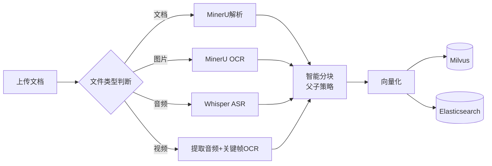
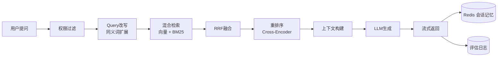
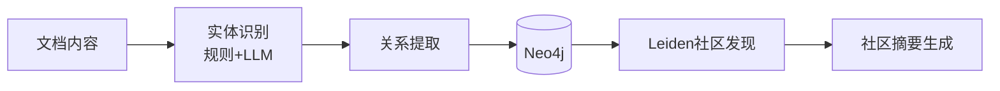
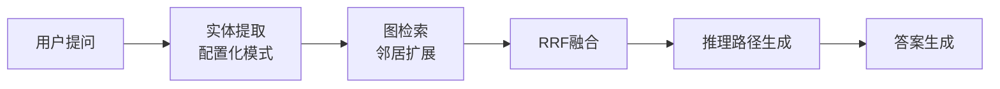
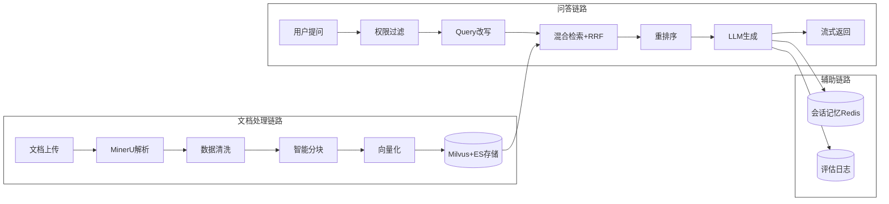
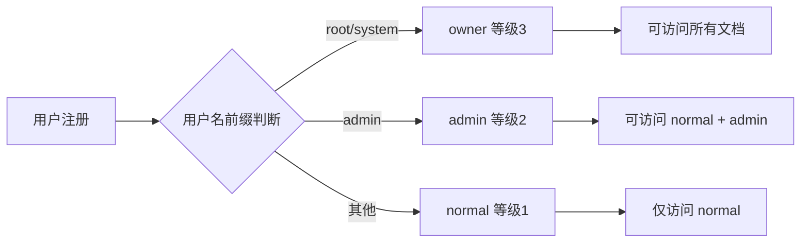

# PaperReadingRAG

**AI行业研究分析助手 RAG | 混合检索 | GraphRAG | 多级权限 | A2A 协议 | 多模态解析**

## 📖 简介

PaperReadingRAG 是一个生产级的 RAG（Retrieval-Augmented Generation）文档问答系统，采用模块化架构设计，提供从文档上传、智能解析、向量化存储到精准问答的完整解决方案。系统支持多格式文档处理（含图片 OCR、音频/视频 ASR 转文字）、混合检索、知识图谱增强、多轮对话记忆，并集成了完善的用户认证与权限管理体系。

### 核心特性

| 特性                  | 说明                                                                       |
| ------------------- | ------------------------------------------------------------------------ |
| 📄 **智能文档处理**       | 支持 PDF/DOCX/TXT/MD/Excel 等多种格式，集成 MinerU 高质量解析                           |
| 🖼️ **多模态解析**       | 图片 OCR（MinerU API）、音频 ASR（Whisper）、视频关键帧提取+OCR                           |
| 🔍 **Advanced RAG** | 混合检索（向量 + BM25）+ RRF 融合 + Query 改写 + 重排序                                 |
| 🕸️ **GraphRAG**    | 知识图谱增强检索（Leiden 社区发现 + Neo4j 存储），实体关系推理                                  |
| 💭 **会话记忆**         | Redis 持久化存储，支持多轮对话上下文（自动过期、分布式共享）                                        |
| 🔐 **多级权限**         | normal / admin / owner 三级用户权限体系，基于用户名的自动等级分配                             |
| 🤝 **A2A 协议**       | Agent-to-Agent 通信（符合 A2A 协议规范），易于集成到多 Agent 系统                           |
| 📊 **RAG 评估**       | Faithfulness、Answer Relevancy、Context Recall、Context Precision、Hit@K、MRR |
| ⚡ **异步处理**          | Redis 队列化文档处理，支持批量上传/删除，并发控制                                             |
| 🎨 **现代化 Web 界面**   | 三页面布局（文档上传/知识图谱/智能问答），支持模式切换（Advanced RAG / GraphRAG）                    |

---

## 🏗️ 系统架构

### 整体架构图


### 技术栈

| 组件        | 技术选型                           |
| --------- | ------------------------------ |
| Web框架     | FastAPI                        |
| 向量数据库     | Milvus                         |
| 全文检索      | Elasticsearch (BM25)           |
| 图数据库      | Neo4j                          |
| 缓存/队列/会话  | Redis                          |
| 用户数据      | PostgreSQL                     |
| 文档解析      | MinerU API                     |
| 图片OCR     | MinerU API                     |
| 语音转文字     | Whisper / FunASR               |
| Embedding | 远程API (DashScope) / 本地模型 (BGE) |
| LLM       | 远程API (Qwen系列)                 |

### 文档处理流程



### 问答检索流程



### GraphRAG 流程

**第一阶段：图谱构建**



**第二阶段：问答检索**



### 数据流向



### 权限控制体系



---

## 📁 项目结构

```
PaperReadingRAG/
├── run_api.py                  # API 服务入口
├── stop_api.py                 # 停止服务脚本
├── app/
│   ├── api/                    # API 路由层
│   │   ├── routes/             # 路由模块
│   │   │   ├── chat.py         # 智能问答（同步/流式/GraphRAG）
│   │   │   ├── upload.py       # 文档上传（支持多模态）
│   │   │   ├── delete.py       # 文档删除（单个/批量）
│   │   │   ├── graph_rag.py    # GraphRAG 构建/管理
│   │   │   └── health.py       # 健康检查
│   │   ├── services/           # 业务服务
│   │   │   ├── chat_service.py # 问答服务（含评估）
│   │   │   └── document_service.py
│   │   ├── auth_routes.py      # JWT 认证
│   │   ├── config.py           # API 配置
│   │   ├── dependencies.py     # 依赖注入
│   │   ├── models.py           # Pydantic 模型
│   │   └── main.py             # FastAPI 应用
│   ├── service/                # 核心服务层
│   │   └── core/
│   │       ├── rag/            # RAG 核心
│   │       │   ├── __init__.py     # 文档处理、搜索、生成
│   │       │   ├── async_processor.py  # Redis 队列异步处理
│   │       │   └── cached_search.py   # 搜索缓存
│   │       ├── retrieval/      # 检索增强
│   │       │   ├── hybrid.py        # 混合检索器 + 父子检索
│   │       │   ├── es_bm25.py       # ES BM25 检索
│   │       │   ├── reranker.py      # 重排序
│   │       │   └── rewriter.py      # Query 改写
│   │       ├── graphrag/       # 知识图谱 RAG
│   │       │   ├── service.py       # GraphRAG 主服务
│   │       │   ├── core.py          # 实体关系提取
│   │       │   ├── neo4j_store.py   # Neo4j 存储
│   │       │   ├── community.py     # Leiden 社区发现
│   │       │   └── retriever.py     # 图检索 + 推理路径
│   │       ├── embedding/      # 向量化
│   │       │   ├── service.py       # Embedding 服务
│   │       │   ├── remote.py        # 远程 API
│   │       │   ├── local.py         # 本地模型
│   │       │   └── cached.py        # 缓存包装
│   │       ├── vector_store/   # Milvus 存储
│   │       │   ├── milvus_vector_store.py
│   │       │   ├── vector_storage_service.py
│   │       │   └── vector_search_service.py
│   │       ├── memory/         # 会话记忆
│   │       │   ├── redis_session_memory.py
│   │       │   └── memory_injector.py
│   │       ├── llm/            # LLM 调用
│   │       │   ├── remote_llm.py
│   │       │   └── cached_llm.py
│   │       ├── prompt/         # Prompt 模板
│   │       │   ├── templates.py
│   │       │   ├── context_constructor.py
│   │       │   └── prompt_builder.py
│   │       ├── deepdoc/        # 文档解析
│   │       │   ├── cleaner.py       # 数据清洗
│   │       │   └── remote_parser.py # MinerU 解析
│   │       ├── chunking/       # 智能分块
│   │       │   ├── splitter.py      # 父子分块器
│   │       │   └── types.py         # 数据结构
│   │       ├── multimodal/     # 多模态解析
│   │       │   ├── parser.py        # 统一解析器
│   │       │   ├── ocr.py           # OCR 服务
│   │       │   ├── asr.py           # ASR 服务
│   │       │   └── models.py        # 数据模型
│   │       ├── cache/          # Redis 多级缓存
│   │       │   ├── cache_manager.py
│   │       │   └── document_cache.py
│   │       └── evaluation/     # RAG 评估
│   │           ├── evaluator.py
│   │           ├── metrics.py
│   │           └── logger.py
│   ├── a2a/                    # A2A 协议实现
│   │   ├── server.py           # A2A 服务端
│   │   ├── agent_card.py       # Agent 信息卡片
│   │   └── well_known.py       # 发现端点
│   ├── auth/                   # JWT 工具
│   │   └── jwt_utils.py
│   ├── db/                     # PostgreSQL 模型
│   │   ├── config.py           # 数据库配置
│   │   ├── models.py           # SQLAlchemy 模型
│   │   └── database.py         # 数据库管理
│   ├── web/                    # Web 前端界面
│   │   ├── chat.html           # 智能问答页面
│   │   ├── upload.html         # 文档上传页面
│   │   ├── graph.html          # 知识图谱可视化
│   │   ├── login.html          # 登录/注册页面
│   │   ├── css/                # 样式文件
│   │   └── js/                 # 前端 JS 模块化
│   └── service/
│       ├── graphrag_configs/   # GraphRAG YAML 配置
│       └── synonymlist/        # 同义词表
├── uploads/                    # 上传文件存储
├── logs/                       # 日志目录
└── docparselist/               # MinerU 解析报告
```

---

## 🚀 快速开始

### 环境要求

- Python 3.9+
- MinerU API Token（[申请地址](https://mineru.net)）
- 可选：ffmpeg（视频处理）、whisper（本地 ASR）

### 依赖服务（需提前启动）

| 服务            | 端口    | 用途       | 必需           |
| ------------- | ----- | -------- | ------------ |
| Milvus        | 19530 | 向量数据库    | ✅            |
| Elasticsearch | 9200  | BM25 检索  | ✅            |
| Redis         | 6379  | 会话/缓存/队列 | ✅            |
| Neo4j         | 7687  | 知识图谱     | 可选（GraphRAG） |
| PostgreSQL    | 5432  | 用户数据     | ✅            |

### 1. 克隆项目

```bash
git clone https://github.com/yourusername/PaperReadingRAG.git
cd PaperReadingRAG
```

### 2. 安装依赖

```bash
python -m venv venv
source venv/bin/activate  # Windows: venv\Scripts\activate

pip install -r requirements.txt
```

### 3. 配置环境变量

创建 `.env` 文件：

```bash
# ========== LLM 配置 ==========
LLM_API_KEY=your-dashscope-api-key
LLM_MODEL=qwen-turbo
LLM_BASE_URL=https://dashscope.aliyuncs.com/compatible-mode/v1

# ========== Embedding 配置 ==========
EMBEDDING_API_KEY=your-dashscope-api-key
EMBEDDING_MODEL=text-embedding-v3
EMBEDDING_DIMENSIONS=1024
EMBEDDING_TYPE=remote

# ========== MinerU 文档解析 ==========
PARSE_API_TOKEN=your-mineru-token
ENABLE_REMOTE_PARSE=true

# ========== 数据库配置 ==========
POSTGRES_HOST=localhost
POSTGRES_PORT=5432
POSTGRES_USER=postgres
POSTGRES_PASSWORD=your-password
POSTGRES_DB=rag_db

# ========== Redis 配置 ==========
REDIS_HOST=localhost
REDIS_PORT=6379
REDIS_PASSWORD=your-redis-password
REDIS_DB=0

# ========== Milvus 配置 ==========
VECTOR_STORE_HOST=localhost
VECTOR_STORE_PORT=19530

# ========== Elasticsearch 配置 ==========
ES_HOST=localhost
ES_PORT=9200

# ========== Neo4j 配置（GraphRAG）==========
NEO4J_URI=bolt://localhost:7687
NEO4J_USER=neo4j
NEO4J_PASSWORD=your-neo4j-password
GRAPH_RAG_ENABLED=true

# ========== JWT 配置 ==========
JWT_SECRET_KEY=your-secret-key-change-in-production
JWT_EXPIRE_HOURS=24

# ========== 多模态配置（可选）==========
OCR_TYPE=paddle          # paddle / easyocr / tesseract / cloud
ASR_TYPE=whisper         # whisper / funasr / cloud

# ========== 评估配置 ==========
ENABLE_EVAL=false        # 生产环境建议关闭
EVAL_SAMPLE_RATE=0.1
```

### 4. 启动服务

```bash
# 启动完整服务（API + A2A）
python run_api.py --host 0.0.0.0 --port 8001 --reload

# 仅启动 A2A 服务（独立部署）
python run_api.py --a2a-only --port 8004

# 停止服务
python stop_api.py 8001
```

### 5. 验证服务

```bash
# 健康检查
curl http://localhost:8001/api/health

# 系统配置
curl http://localhost:8001/api/config

# A2A Agent 发现
curl http://localhost:8001/.well-known/agent.json

# A2A 服务检查
curl http://localhost:8001/a2a/health
```

访问 Web 界面：http://localhost:8001

---

## 📡 API 接口

### 认证接口

| 方法   | 路径                   | 说明           |
| ---- | -------------------- | ------------ |
| POST | `/api/auth/register` | 用户注册（自动分配等级） |
| POST | `/api/auth/login`    | 用户登录         |
| POST | `/api/auth/verify`   | 验证 Token     |

### 文档管理

| 方法     | 路径                           | 说明             |
| ------ | ---------------------------- | -------------- |
| POST   | `/api/upload`                | 上传文档（同步，支持多模态） |
| POST   | `/api/upload/async`          | 上传文档（异步，推荐）    |
| POST   | `/api/upload/batch`          | 批量上传           |
| GET    | `/api/upload/list`           | 文档列表（分页，权限过滤）  |
| DELETE | `/api/upload/{filename}`     | 删除文档（权限校验）     |
| POST   | `/api/upload/delete-batch`   | 批量删除           |
| GET    | `/api/upload/task/{task_id}` | 查询处理状态         |

### 智能问答

| 方法     | 路径                               | 说明                 |
| ------ | -------------------------------- | ------------------ |
| POST   | `/api/chat/ask`                  | 同步问答（Advanced RAG） |
| POST   | `/api/chat/ask/stream`           | 流式问答（Advanced RAG） |
| POST   | `/api/chat/graph/ask`            | GraphRAG 问答        |
| POST   | `/api/chat/graph/ask/stream`     | GraphRAG 流式问答      |
| POST   | `/api/chat/search`               | 仅检索（不生成）           |
| POST   | `/api/chat/generate`             | 仅生成（基于检索结果）        |
| GET    | `/api/chat/session/create`       | 创建会话               |
| GET    | `/api/chat/session/{id}`         | 获取会话信息             |
| GET    | `/api/chat/session/{id}/history` | 会话历史               |
| DELETE | `/api/chat/session/{id}`         | 清除会话               |
| GET    | `/api/chat/sessions`             | 活跃会话列表             |

### GraphRAG 管理

| 方法   | 路径                                 | 说明           |
| ---- | ---------------------------------- | ------------ |
| POST | `/api/chat/graph/build`            | 构建知识图谱（支持缓存） |
| GET  | `/api/chat/graph/status`           | 图谱状态         |
| POST | `/api/chat/graph/invalidate-cache` | 清除图谱缓存       |
| GET  | `/api/chat/graph/cache-stats`      | 缓存统计         |

### A2A 协议接口

| 方法   | 路径                        | 说明                   |
| ---- | ------------------------- | -------------------- |
| GET  | `/.well-known/agent.json` | Agent 发现（A2A 标准）     |
| GET  | `/a2a/health`             | 健康检查                 |
| POST | `/a2a/rag/search`         | RAG 检索（供其他 Agent 调用） |
| POST | `/a2a/rag/ask`            | RAG 问答（供其他 Agent 调用） |
| GET  | `/a2a/capabilities`       | 能力摘要                 |
| GET  | `/a2a/info`               | Agent 基本信息           |

### 调用示例

```bash
# 1. 用户注册
curl -X POST http://localhost:8001/api/auth/register \
  -H "Content-Type: application/json" \
  -d '{"username": "admin_user", "password": "admin123"}'

# 2. 用户登录
curl -X POST http://localhost:8001/api/auth/login \
  -H "Content-Type: application/json" \
  -d '{"username": "admin_user", "password": "admin123"}'

# 3. 上传文档（异步）
curl -X POST http://localhost:8001/api/upload/async \
  -H "Authorization: Bearer <your-token>" \
  -F "file=@document.pdf"

# 4. 查询处理状态
curl -X GET http://localhost:8001/api/upload/task/{task_id} \
  -H "Authorization: Bearer <your-token>"

# 5. 流式问答（Advanced RAG）
curl -X POST http://localhost:8001/api/chat/ask/stream \
  -H "Authorization: Bearer <your-token>" \
  -H "Content-Type: application/json" \
  -d '{"question": "什么是RAG技术？", "session_id": "test-session"}'

# 6. GraphRAG 流式问答
curl -X POST http://localhost:8001/api/chat/graph/ask/stream \
  -H "Authorization: Bearer <your-token>" \
  -H "Content-Type: application/json" \
  -d '{"question": "介绍一下Transformer架构"}

# 7. 构建知识图谱
curl -X POST http://localhost:8001/api/chat/graph/build \
  -H "Authorization: Bearer <your-token>" \
  -H "Content-Type: application/json" \
  -d '{"all_documents": true, "force_rebuild": false}'

# 8. 获取知识图谱状态
curl -X GET http://localhost:8001/api/chat/graph/status \
  -H "Authorization: Bearer <your-token>"
```

---

## 🔧 核心模块详解

### Advanced RAG 流程

```python
# 完整问答流程
1. Query 改写（同义词扩展 + YAML 配置化同义词表）
2. 混合检索（向量 + BM25，RRF 融合）
3. 重排序（Cross-Encoder 模型）
4. 上下文构建（带文档来源）
5. LLM 生成（流式输出）
6. 会话记忆保存（Redis 持久化）
7. 异步评估（Faithfulness/Relevancy/Recall/Precision）
```

### GraphRAG 流程

```python
# 知识图谱增强流程
1. 实体识别（YAML 配置的规则模式 + LLM 增强）
2. 关系提取（配置化的关系模式）
3. Neo4j 存储（支持批量写入）
4. 社区发现（Leiden 算法，带权重）
5. 社区摘要生成
6. 图检索（实体为中心 + RRF 融合 + 邻居扩展）
7. 推理路径展示（最短路径算法）
```

### 多模态解析流程

```python
# 图片/音频/视频处理流程
1. 图片：MinerU API OCR → 提取文字
2. 音频：Whisper/FunASR → 语音转文字
3. 视频：ffmpeg 提取音频流 + 关键帧 → 音频 ASR + 关键帧 OCR → 合并文字
4. 统一输出：提取的文字内容进入文档处理管道
```

### 权限控制

```python
# 用户等级与文档访问控制
等级体系: normal (1) → admin (2) → owner (3)

权限规则:
- normal: 只能访问/删除 normal 文档
- admin: 可访问/删除 normal 和 admin 文档
- owner: 可访问/删除所有文档

# 自动等级分配（注册时）
username 以 'root'/'system' 开头 → owner
username 以 'admin' 开头 → admin
其他 → normal
```

---

## 📊 RAG 评估指标

系统自动记录以下评估指标到 `logs/evaluation_*.log`（支持异步采样评估）：

| 指标                | 说明          | 评估方式   | 计算公式            |
| ----------------- | ----------- | ------ | --------------- |
| Faithfulness      | 答案忠实度（0-1）  | LLM 评估 | 答案信息在上下文中的可验证比例 |
| Answer Relevancy  | 答案相关性（0-1）  | LLM 评估 | 答案与问题的匹配程度      |
| Context Recall    | 上下文召回率（0-1） | LLM 评估 | 答案所需信息被上下文覆盖的比例 |
| Context Precision | 上下文精确率（0-1） | LLM 评估 | 检索上下文中相关内容的比例   |
| Hit@K             | 命中率（0-1）    | 规则匹配   | 前K个结果是否包含相关文档   |
| MRR               | 平均倒数排名（0-1） | 规则匹配   | 第一个相关文档的倒数排名    |

```bash
# 查看评估日志
tail -f logs/evaluation_$(date +%Y%m%d).log

# 查看错误日志
tail -f logs/rag_error_$(date +%Y%m%d).log

# 查看详细日志
tail -f logs/rag_$(date +%Y%m%d).log
```

---

## 🔌 A2A 协议集成

本系统实现了标准的 A2A（Agent-to-Agent）通信协议，可作为 RAG Agent 被其他 Agent 调用。

### Agent 发现

```json
// GET /.well-known/agent.json
{
  "id": "paperreadingrag",
  "name": "PaperReadingRAG",
  "description": "专业的文档问答 RAG Agent，支持 PDF、DOCX、TXT 等格式的文档解析、检索和智能问答",
  "version": "1.0.0",
  "url": "http://localhost:8001",
  "skills": [
    {
      "name": "rag_search",
      "description": "从知识库中检索相关文档片段，支持混合检索和重排序",
      "tags": ["检索", "RAG", "文档"],
      "examples": ["请帮我查找关于 RAG 技术的内容", "文档中提到了什么关键数据？"]
    },
    {
      "name": "document_qa",
      "description": "基于文档内容的智能问答，支持多轮对话",
      "tags": ["问答", "对话", "文档"],
      "examples": ["这个文档的主要观点是什么？", "可以详细解释一下这个概念吗？"]
    },
    {
      "name": "knowledge_retrieval",
      "description": "纯检索接口，只返回相关文档片段，不生成答案",
      "tags": ["检索", "文档"],
      "examples": ["查找关于 XX 的内容"]
    }
  ],
  "capabilities": {
    "streaming": true,
    "memory": true,
    "rerank": true,
    "query_rewrite": true
  },
  "endpoints": {
    "health": "http://localhost:8001/a2a/health",
    "rag_search": "http://localhost:8001/a2a/rag/search",
    "rag_ask": "http://localhost:8001/a2a/rag/ask"
  }
}
```

### 调用示例

```bash
# 其他 Agent 调用 RAG 检索
curl -X POST http://localhost:8001/a2a/rag/search \
  -H "Content-Type: application/json" \
  -d '{
    "query": "RAG技术介绍",
    "top_k": 5,
    "need_answer": true
  }'

# 响应示例
{
  "success": true,
  "answer": "RAG（Retrieval-Augmented Generation）是一种...",
  "documents": [
    {"content": "...", "score": 0.89, "document_name": "rag_intro.pdf"}
  ],
  "session_id": "abc123..."
}
```

---

## 🗂️ GraphRAG 配置化

GraphRAG 的实体提取、关系模式、同义词等均通过 YAML 配置，位于 `app/service/graphrag_configs/`：

| 配置文件                     | 说明                | 示例                                                           |
| ------------------------ | ----------------- | ------------------------------------------------------------ |
| `entity_types.yml`       | 实体类型定义（颜色、图标、优先级） | PERSON, ORGANIZATION, LOCATION                               |
| `relation_types.yml`     | 关系类型定义（权重、方向）     | WORKS_FOR, LOCATED_IN, RELATED_TO                            |
| `entity_patterns.yml`    | 实体正则提取模式          | `([\u4e00-\u9fff]{2,}(?:公司\|集团))`                            |
| `relation_patterns.yml`  | 关系正则提取模式          | `([\u4e00-\u9fff]{2,})[\u7684]?(?:董事长)([\u4e00-\u9fff]{2,})` |
| `entity_aliases.yml`     | 实体别名映射            | `"阿里": "阿里巴巴"`                                               |
| `query_replacements.yml` | 查询替换规则            | `"AI": "人工智能"`                                               |
| `entity_extraction.yml`  | 实体提取参数配置          | min_entity_length: 2                                         |

同义词表位于 `app/service/synonymlist/`，支持动态加载和扩展：

```yaml
# synonymlist/technology.yml
RAG:
  - 检索增强生成
  - 检索增强
  - Retrieval-Augmented Generation

向量数据库:
  - 向量库
  - 向量存储
  - Milvus
```

---

## 📝 日志系统

系统采用分级日志，详细日志写入文件，控制台只保留重要信息：

| 日志文件                           | 说明               |
| ------------------------------ | ---------------- |
| `logs/rag_YYYYMMDD.log`        | 详细日志（DEBUG/INFO） |
| `logs/rag_error_YYYYMMDD.log`  | 错误日志（ERROR 及以上）  |
| `logs/evaluation_YYYYMMDD.log` | RAG 评估日志         |
